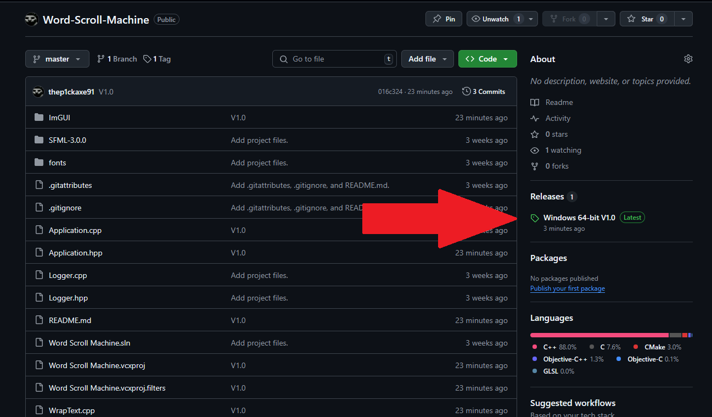
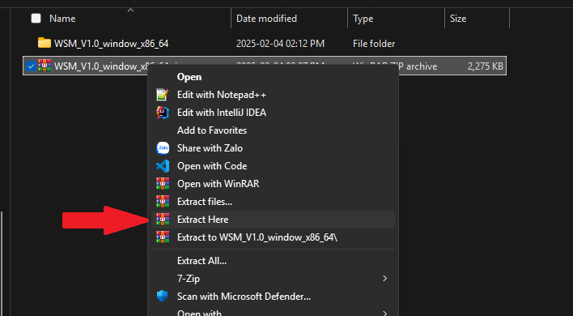
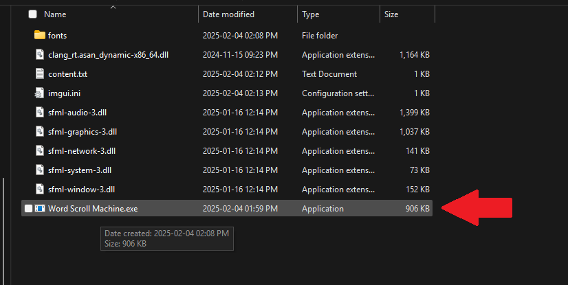

me
# Word Scroll Machine

WSM là phần mềm dùng để hiển thị cho máy đọc chữ, với 1 cửa sổ của người điều khiển và 1 cửa sổ dành cho người đọc

# Hướng dẫn sử dụng

## Cài đặt

### Bước 1:
Tải bản release mới nhất ở đây:

### Bước 2:
Giải nén và mở **Word Scroll Machine.exe**

## Trong cửa sổ Control

- :video_game: Bấm F1 để bật/tắt bảng điều khiển 
- :floppy_disk: Bấm nút "Load Content" để tải nội dung từ file **content.txt** trong cùng thư mục với file exe
- :scroll:  Chỉnh sửa tốc độ lăn bằng cách thay đổi **Scroll Speed**
- :ab: Tăng giảm kích thước chữ bằng cách thay đổi **Font size**
- :arrows_clockwise: Thay đổi hướng lăn với nút **Rotate 90 cw**